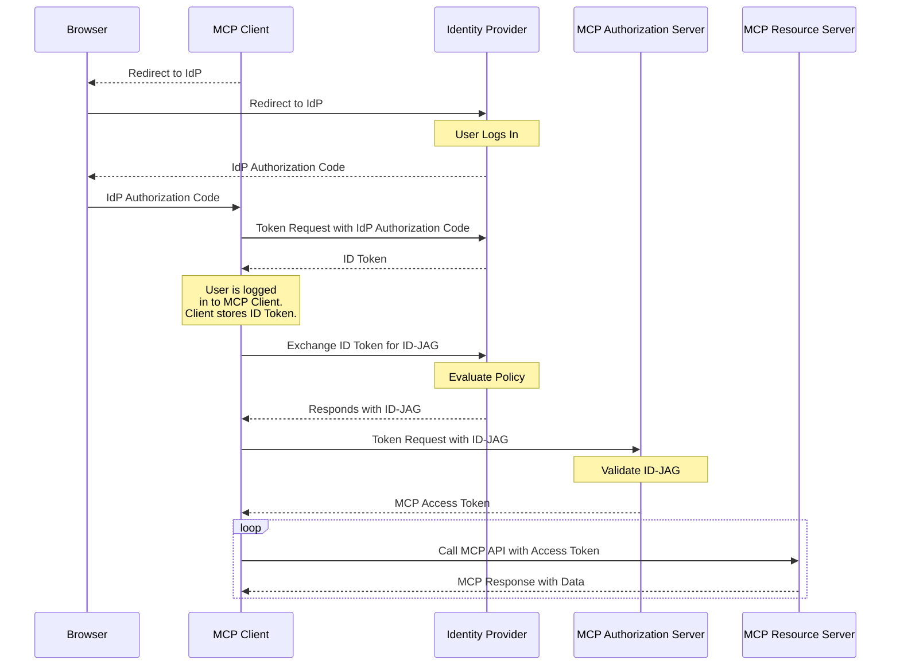

<Info>**Status**: Stable</Info>

## 1. Introduction

### 1.1 Purpose and Scope

This document defines an application of the "[Identity Assertion JWT Authorization Grant](https://datatracker.ietf.org/doc/draft-ietf-oauth-identity-assertion-authz-grant/)" for use within enterprise deployments of the Model Context Protocol (MCP).

When an MCP Client and MCP Server are both enabled for single sign-on through an enterprise Identity Provider, this three-way relationship can be leveraged to streamline the authorization process.

This document specifies how an MCP Client can obtain an access token from an MCP Server's authorization server by presenting an identity assertion it previously obtained from an enterprise Identity Provider during single sign-on, and how that authorization server validates the request before issuing an access token.

This profile is designed to facilitate secure and interoperable authorization within enterprise environments, leveraging the organization's existing identity infrastructure. Enterprise-managed authorization for MCP Clients and Servers has some key benefits:

- For end users, this removes the need to manually connect and authorize the MCP Client to each MCP Server for use within the organization.
- For enterprise admins, this enables visibility and control over which MCP Servers are able to be used within the organization.
- For MCP clients, this enables the client to automatically obtain access tokens for any connected MCP servers without user interaction, and removes the need for user interaction when obtaining new access tokens.

### 1.2 Roles and Terminology

This document uses the roles and terms defined in [Section 2 of draft-ietf-oauth-identity-assertion-authz-grant](https://www.ietf.org/archive/id/draft-ietf-oauth-identity-assertion-authz-grant-04.html#section-2). In the context of this profile:

- The **Client** is the MCP Client.
- The **Resource Server** is the MCP Server.
- The **Resource Authorization Server** is the authorization server that issues access tokens for the MCP Server, as advertised in the MCP Server's Protected Resource Metadata ([RFC9728](https://datatracker.ietf.org/doc/html/rfc9728)).
- The **IdP Authorization Server (IdP)** is the enterprise Identity Provider used for single sign-on.

## 2. Identity Assertion Authorization Grant Overview

This profile is an application of the "Identity Assertion JWT Authorization Grant" [draft-ietf-oauth-identity-assertion-authz-grant](https://datatracker.ietf.org/doc/draft-ietf-oauth-identity-assertion-authz-grant/), which itself is a profile of "Identity Chaining Across Trust Domains" [draft-ietf-oauth-identity-chaining](https://datatracker.ietf.org/doc/draft-ietf-oauth-identity-chaining/).

The Identity Assertion JWT Authorization Grant follows three steps:

1. Single Sign-On to the MCP Client via OpenID Connect or SAML
2. Token Exchange ([RFC8693](https://datatracker.ietf.org/doc/html/rfc8693))
3. JWT Authorization Grant ([RFC7523](https://datatracker.ietf.org/doc/html/rfc7523))

The core flow is as follows:

- A user logs in to an MCP Client through their enterprise Identity Provider, resulting in an Identity Assertion (ID Token or SAML assertion) being issued to the MCP Client.
- The MCP Client sends a Token Exchange [[RFC8693](https://datatracker.ietf.org/doc/html/rfc8693)] request to the Identity Provider including the identity assertion and identifier of the MCP Server it is attempting to access, and obtains a Identity Assertion JWT Authorization Grant (ID-JAG).
- The MCP Client uses the Identity Assertion JWT Authorization Grant as a JWT Authorization Grant [[RFC7523](https://datatracker.ietf.org/doc/html/rfc7523)] to request an access token from the Resource Authorization Server.
- The Resource Authorization Server validates the Identity Assertion JWT Authorization Grant and, if valid, issues an access token.
- The MCP Client uses the access token to make requests to the MCP Server.

### 2.1 Sequence Diagram

The following diagram outlines an example flow:



## 3. User Authentication

To authenticate a user, the MCP Client initiates the process through a request with the IdP using OpenID Connect or SAML.

For example, a web-based MCP client might initiate the user authentication process by redirecting the browser using OpenID Connect:

```
302 Redirect
Location: https://acme.idp.example/authorize?response_type=code&scope=openid&client_id=...
```

The user authenticates with the IdP, and is redirected back to the Client with an authorization code, which it can then exchange for an ID Token.

The enterprise IdP may enforce additional security controls such as multi-factor authentication before granting the user access to the MCP Client.
For example, in an OpenID Connect flow, after receiving a redirect from the IdP with an authorization code, the MCP Client makes a request to the IdP's token endpoint and, if valid, receives the tokens in the response:

```
POST /token HTTP/1.1
Host: acme.idp.example
Content-Type: application/x-www-form-urlencoded

grant_type=authorization_code
&code=.....

HTTP/1.1 200 OK
Content-Type: application/json

{
  "id_token": "eyJraWQiOiJzMTZ0cVNtODhwREo4VGZCXzdrSEtQ...",
  "token_type": "Bearer",
  "access_token": "7SliwCQP1brGdjBtsaMnXo",
  "scope": "openid"
}
```

## 4. Token Exchange

To request an ID-JAG, the MCP Client makes a Token Exchange request to the IdP's token endpoint as defined in [Section 4.3 of draft-ietf-oauth-identity-assertion-authz-grant](https://www.ietf.org/archive/id/draft-ietf-oauth-identity-assertion-authz-grant-04.html#section-4.3).

In this profile:

- `audience` **MUST** be the issuer identifier of the Resource Authorization Server.
- `resource` is **REQUIRED** and **MUST** be the Resource Identifier of the MCP Server as defined in [RFC9728](https://datatracker.ietf.org/doc/html/rfc9728).

If the IdP requires client authentication when the MCP Client performs OpenID Connect for single sign-on, then client authentication of the Token Exchange request is also required.

The example below illustrates the Token Exchange request, using an OpenID Connect ID Token as the Identity Assertion and a client secret as the client authentication method. The ID token is passed as a Subject Token.

```
POST /oauth2/token HTTP/1.1
Host: acme.idp.example
Content-Type: application/x-www-form-urlencoded

grant_type=urn:ietf:params:oauth:grant-type:token-exchange
&requested_token_type=urn:ietf:params:oauth:token-type:id-jag
&audience=https://auth.chat.example/
&resource=https://mcp.chat.example/
&scope=chat.read+chat.history
&subject_token=eyJraWQiOiJzMTZ0cVNtODhwREo4VGZCXzdrSEtQ...
&subject_token_type=urn:ietf:params:oauth:token-type:id_token
&client_id=2ec954a1d60620116d36d9ceb7
&client_secret=a26d84873504215a34a86d52ef5cd64f4b76
```

### 4.1 Processing Rules

The IdP processes the request according to [Section 4.3.3 of draft-ietf-oauth-identity-assertion-authz-grant](https://www.ietf.org/archive/id/draft-ietf-oauth-identity-assertion-authz-grant-04.html#section-4.3.3). The IdP evaluates administrator-defined policies for the token exchange request and determines if the MCP Client should be granted access to act on behalf of the user for the target MCP Server and scopes.

### 4.2 Token Exchange Response

If access is granted, the IdP returns the ID-JAG in a token exchange response as defined in [Section 4.3.4 of draft-ietf-oauth-identity-assertion-authz-grant](https://www.ietf.org/archive/id/draft-ietf-oauth-identity-assertion-authz-grant-04.html#section-4.3.4):

```
HTTP/1.1 200 OK
Content-Type: application/json
Cache-Control: no-store
Pragma: no-cache

{
  "issued_token_type": "urn:ietf:params:oauth:token-type:id-jag",
  "access_token": "eyJhbGciOiJIUzI1NiIsI...",
  "token_type": "N_A",
  "scope": "chat.read chat.history",
  "expires_in": 300
}
```

Error responses are returned as OAuth 2.0 Token Error responses per [Section 5.2 of RFC6749](https://datatracker.ietf.org/doc/html/rfc6749#section-5.2).

### 4.3 Identity Assertion JWT Authorization Grant

The ID-JAG is a JWT issued and signed by the IdP with the claims defined in [Section 3.1 of draft-ietf-oauth-identity-assertion-authz-grant](https://www.ietf.org/archive/id/draft-ietf-oauth-identity-assertion-authz-grant-04.html#section-3.1).

In this profile, the `resource` claim is **REQUIRED** and **MUST** contain the Resource Identifier of the MCP Server.

An example JWT shown with expanded header and payload claims may look like this:

```
{
  "typ": "oauth-id-jag+jwt"
}
.
{
  "jti": "9e43f81b64a33f20116179",
  "iss": "https://acme.idp.example",
  "sub": "U019488227",
  "aud": "https://auth.chat.example/",
  "resource": "https://mcp.chat.example/",
  "client_id": "f53f191f9311af35",
  "exp": 1311281970,
  "iat": 1311280970,
  "scope": "chat.read chat.history"
}
.
signature
```

See [Section 6 of draft-ietf-oauth-identity-assertion-authz-grant](https://www.ietf.org/archive/id/draft-ietf-oauth-identity-assertion-authz-grant-04.html#section-6) for handling of multi-tenant issuers and subject identifier uniqueness.

## 5. Access Token Request

The MCP Client presents the ID-JAG to the Resource Authorization Server's token endpoint as defined in [Section 4.4 of draft-ietf-oauth-identity-assertion-authz-grant](https://www.ietf.org/archive/id/draft-ietf-oauth-identity-assertion-authz-grant-04.html#section-4.4), using `grant_type` `urn:ietf:params:oauth:grant-type:jwt-bearer` and the ID-JAG as the `assertion`.

The MCP Client authenticates with its credentials as registered with the Resource Authorization Server.

If the MCP Client is not pre-registered with the Resource Authorization Server, then it can use its [Client ID Metadata Document](/specification/2025-11-25/basic/authorization#client-id-metadata-documents) as its client ID, and optionally authenticate using [private_key_jwt](https://www.ietf.org/archive/id/draft-ietf-oauth-client-id-metadata-document-01.html#section-6.2).

An example request may look like this:

```
POST /oauth2/token HTTP/1.1
Host: auth.chat.example

grant_type=urn:ietf:params:oauth:grant-type:jwt-bearer
&assertion=eyJhbGciOiJIUzI1NiIsI...
&client_id=https://client.example.com/client.json
```

### 5.1 Processing Rules

The Resource Authorization Server processes the request according to [Section 4.4.1 of draft-ietf-oauth-identity-assertion-authz-grant](https://www.ietf.org/archive/id/draft-ietf-oauth-identity-assertion-authz-grant-04.html#section-4.4.1).

In this profile, the issued access token **MUST** be audience-restricted to the MCP Server identified by the `resource` claim in the ID-JAG.

### 5.2 Access Token Response

The Resource Authorization Server responds with an OAuth 2.0 Token Response, like this:

```
HTTP/1.1 200 OK
Content-Type: application/json
Cache-Control: no-store

{
  "token_type": "Bearer",
  "access_token": "2YotnFZFEjr1zCsicMWpAA",
  "expires_in": 86400,
  "scope": "chat.read chat.history"
}
```

## 6. Discovery

An MCP Client can determine that a Resource Authorization Server supports this profile by checking for `urn:ietf:params:oauth:grant-profile:id-jag` in the `authorization_grant_profiles_supported` field of the server's authorization server metadata, as defined in [Section 7.2 of draft-ietf-oauth-identity-assertion-authz-grant](https://www.ietf.org/archive/id/draft-ietf-oauth-identity-assertion-authz-grant-04.html#section-7.2).

## 7. Security Considerations

### 7.1 Client Registration

In most enterprise deployments, the IdP policy will only allow users to sign in to pre-registered clients. The MCP client will likely need to be pre-registered with the enterprise IdP for single sign-on.

It is also assumed that the MCP client will be pre-registered with the Resource Authorization Server.

See [Section 5 of draft-ietf-oauth-identity-assertion-authz-grant](https://www.ietf.org/archive/id/draft-ietf-oauth-identity-assertion-authz-grant-04.html#section-5) for how the IdP determines the `client_id` value to include in the ID-JAG.

### 7.2 Scope of Enterprise Visibility and Policy Enforcement

This specification enables the enterprise IdP to be part of the issuance of the access token at the MCP Server. The visibility the IdP has between the MCP Client and MCP Server is limited to the process of issuing the access token, but does not extend to the actual API calls between the MCP Client and Server.

This enables the enterprise IdP to enforce policies such as which users in the organization can use certain MCP clients with certain MCP servers. Depending on the granularity of the OAuth scopes defined at the MCP server, this can also extend to govern which scopes a given user can request.

For example, the enterprise policy of granting an access token through this extension may allow users in the "engineering" group to get read-only access from an AI code editor to the source control MCP server, whereas users in the "marketing" group may be able to get read and write access to the internal documentation application.
